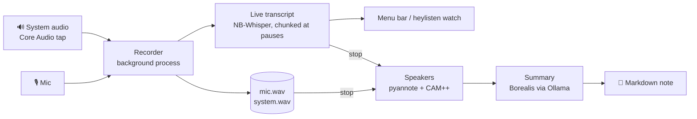

<div align="center">

# 🧚 heyListen

**Hey, listen!** Norwegian meeting notes that never leave your Mac.

Record a Teams, Slack, Meet or in-person meeting from your menu bar and watch the transcript appear as people talk.
When you stop, a Markdown note lands on your Desktop with a summary, decisions, tasks and who said what.


**[⬇️ Download for Mac (Apple Silicon)](https://github.com/nikolaia/heylisten/releases/latest/download/heyListen-macos-arm64.zip)**

</div>

---

```markdown
---
title: "Kundemøte"
date: 2026-10-01
start: "09:30"
duration_min: 47
speakers: [Meg, Taler 1, Taler 2]
type: meeting
tags: [møte]
---

## Sammendrag
Møtet handlet om å øke markedsføringsbudsjettet for neste år …

## Oppgaver
- [ ] Forberede tall for ledermøtet på fredag (ansvarlig: Taler 2)

## Transkripsjon
**Taler 1** [00:00:02]
Hei og velkommen, skal vi starte med budsjettet?
```

## ✨ Features

- 🔒 **Your meetings stay on your Mac.** Recording, transcription and summaries all run locally. The only downloads are the models, once, when you ask for them.
- 🎙️ **Mic and system audio** recorded as two separate tracks. System audio is captured directly by macOS, so there's no BlackHole or virtual driver.
- ⚡ **Live transcript** with [NB-Whisper](https://huggingface.co/NbAiLab/nb-whisper-large), the National Library of Norway's Whisper. By the time you stop, the transcript is already done.
- 🗣️ **Tells speakers apart**, both remote people and several people sharing one mic in a meeting room.
- 🔁 **Echo removal**, so not wearing headphones doesn't put every line in the note twice.
- 📝 **Norwegian summary** from [Borealis](https://huggingface.co/NbAiLab/borealis-12b-gguf) via [Ollama](https://ollama.com): summary, decisions, `- [ ]` tasks and topics. The prompt is a file you can edit.
- 📄 **Plain Markdown notes** with YAML frontmatter, so they work as-is in any notes app that reads Markdown.
- 💾 **Crash-safe.** Audio streams to disk as it's recorded, so a crash or a closed terminal keeps everything recorded so far.

## 🚀 Getting started

1. **[Download heyListen](https://github.com/nikolaia/heylisten/releases/latest/download/heyListen-macos-arm64.zip)**, unzip it, and move **heyListen.app** to *Applications*.
2. **Open it.** The app isn't notarized by Apple yet, so macOS blocks it the first time. Go to System Settings → Privacy & Security, scroll down and click **Open Anyway**. You only do this once.
3. Click the **ring ◯ in your menu bar** and choose **Download models (~8 GB)…**. This fetches the speech model (1.1 GB) and the summary model (7 GB). Progress is shown in the menu.
4. For summaries, choose **Install Ollama…** if it's in the menu, install and open Ollama, then click **Download models** again for the summary model. Without Ollama you still get transcripts.
5. Choose **Start recording**. On the first recording, macOS asks for permission to use the **microphone** and to **record system audio**. Allow both.

| In the menu | |
|---|---|
| ◯ ring | Idle |
| 🔴 red dot + `00:12:34` | Recording |
| 🟠 orange dot | Making the note, or downloading models |
| **Recent notes** | Your last 10 notes; click to open |
| **Set notes location…** | Where notes go (default: Desktop) |

To have heyListen start with your Mac, add it under System Settings → General → Login Items.

## ⌨️ Command line

The app bundles a `heylisten` CLI that does the same things, which is handy for hotkeys (Raycast, Alfred) or for importing files:

```bash
alias heylisten=/Applications/heyListen.app/Contents/MacOS/heylisten

heylisten start [title]        # record in the background and show the live transcript
                               # (Ctrl+C closes the view; recording continues)
heylisten watch                # re-attach the live view
heylisten status               # recording or idle
heylisten stop                 # stop and write the note
heylisten process memo.m4a     # transcribe an audio file (m4a, mp3, wav, flac, ogg)
heylisten process <meeting-id> # redo a meeting from its saved audio
heylisten setup                # download the models
heylisten doctor               # check everything, with copy-paste fixes
```

The tray app and the CLI share one recorder, so you can start a recording in one and stop it in the other.

### Configuration

`~/.config/heylisten/config.toml` is created on first run. Every setting is optional:

```toml
notes_dir = "~/Desktop"                             # where notes go (the tray can set this)
# whisper_model = "~/models/nb-whisper-large-q5_0.bin"  # default: heyListen's models folder
ollama_model = "hf.co/NbAiLab/borealis-12b-gguf"
ollama_url = "http://localhost:11434"               # keep it local
keep_audio = false                                  # delete the audio once the note is written
```

The summary prompt is `~/.config/heylisten/summary-prompt.md`. Edit it to change what the summary looks like.

## 🔍 How it works



- **Two tracks.** The mic is you (`Meg`) and system audio is everyone else (`Andre`), so the live view can tell them apart from the start.
- **Live.** Each track is cut into chunks at pauses and transcribed as you talk. After stop, only speaker labelling and the summary are left.
- **Speakers.** After stop, voices on both tracks are told apart and numbered `Taler 1`, `Taler 2`… in order of first appearance. If the mic hears only one voice, it stays `Meg`. In a meeting room where several people share a mic, every voice becomes a `Taler`, because heyListen can't know which one is you.
- **Language.** Always Norwegian. NB-Whisper translates English speech into Norwegian rather than transcribing it.
- **If Ollama is down,** the note is written without a summary, the audio is kept, and `heylisten process <id>` retries later.

Meetings (audio while recording, transcripts, metadata) are kept in `~/Library/Application Support/heylisten/meetings/`. The models are in `~/Library/Application Support/heylisten/models/`. The vocabulary is in [CONTEXT.md](CONTEXT.md) and the design decisions in [docs/adr](docs/adr).

## 🔒 Privacy

- **The only downloads** are the speech model (from Hugging Face, checked against a pinned SHA-256) and the summary model (pulled by your local Ollama). Both happen only when you click *Download models* or run `heylisten setup`. See [ADR 0004](docs/adr/0004-models-downloaded-on-request.md).
- **Audio and transcripts** never leave your Mac. The only thing that receives them is Ollama at `ollama_url`, which is `localhost` unless you change it. If you point it elsewhere, heyListen warns you in red every time.

## 🍎 macOS permissions

- **"Apple could not verify heyListen":** the app is ad-hoc signed, not notarized. Click *Open Anyway* under System Settings → Privacy & Security, or run `xattr -dr com.apple.quarantine /Applications/heyListen.app`.
- **Microphone and system audio:** the recorder runs from a small helper app that heyListen keeps in its data folder, so the permissions belong to heyListen and not to whichever terminal or hotkey app started it. Approve once; updates don't ask again.
- **The very first recording** after you click Allow may have an empty system-audio track. Later ones are fine.
- **To check:** System Settings → Privacy & Security → *Microphone*, and *Screen & System Audio Recording* → *System Audio Recording Only*. Both should list heyListen.

## 🛠️ Building from source

```bash
git clone https://github.com/nikolaia/heylisten && cd heylisten
nix develop -c cargo build --release --features tray   # or use rustup + cmake
nix develop -c scripts/bundle-macos.sh                  # → target/heyListen.app
```

The build downloads sherpa-onnx and two small speaker-recognition models, which get embedded in the binary. Pushing a `v*` tag runs [the release workflow](.github/workflows/release.yml), which builds the app and attaches the zip to a GitHub Release.

`HEYLISTEN_DEBUG=1 heylisten start` logs how much audio each track receives, and the speaker turns, to `recorder.log` in the meeting folder.

## 🗺️ Status

| | |
|---|---|
| Menu bar app with first-run setup, recent notes, notes location | ✅ macOS |
| Mic + system audio, live transcript, echo removal | ✅ macOS |
| Speakers, including several people on one mic | ✅ |
| Norwegian summary via Ollama | ✅ |
| Linux (PipeWire recording, tray via AppIndicator) | 🚧 not implemented or tested yet |
| Notarized app | 💭 needs an Apple Developer ID |

## 🙏 Credits

- [NB-Whisper](https://huggingface.co/NbAiLab/nb-whisper-large) and [Borealis](https://huggingface.co/NbAiLab/borealis-12b-gguf) from the National Library of Norway.
- [whisper.cpp](https://github.com/ggml-org/whisper.cpp) via [whisper-rs](https://crates.io/crates/whisper-rs).
- [sherpa-onnx](https://github.com/k2-fsa/sherpa-onnx) via [sherpa-rs](https://github.com/thewh1teagle/sherpa-rs), with [pyannote segmentation 3.0](https://huggingface.co/pyannote/segmentation-3.0) (MIT) and [3D-Speaker CAM++](https://github.com/modelscope/3D-Speaker) (Apache-2.0).
- [tray-icon](https://github.com/tauri-apps/tray-icon), [rfd](https://github.com/PolyMeilex/rfd) and [Ollama](https://ollama.com).
- Ideas from [vaqlo](https://github.com/ivshestakov/vaqlo.app).

## License

[MIT](LICENSE)
