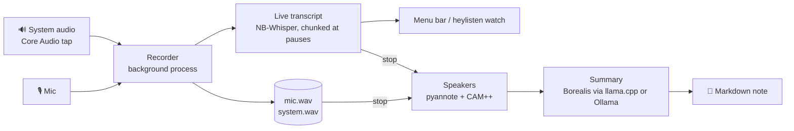

<div align="center">

# 🧚 heyListen

**Hey, listen!** Norwegian meeting notes that never leave your Mac.

Record a Teams, Slack, Meet or in-person meeting from your menu bar and watch the transcript appear as people talk.
When you stop, a Markdown note lands on your Desktop with a summary, decisions, tasks and who said what.


**[⬇️ Download for Mac (Apple Silicon)](https://github.com/nikolaia/heylisten/releases/latest/download/heyListen-macos-arm64.zip)**

</div>

---

```markdown
---
title: "Kundemøte"
date: 2026-10-01
start: "09:30"
duration_min: 47
speakers: [Meg, Kari, Taler 2]
speaker_names:
  - name: "Kari"
    label: "Taler 1"
    evidence: "Kari, kan du starte med testingen"
type: meeting
tags: [møte]
---

## Sammendrag
Møtet handlet om å øke markedsføringsbudsjettet for neste år …

## Oppgaver
- [ ] Forberede tall for ledermøtet på fredag (ansvarlig: Taler 2)

## Transkripsjon
**Taler 1** [00:00:02]
Hei og velkommen, skal vi starte med budsjettet?
```

## ✨ Features

- 🔒 **Your meetings stay on your Mac.** Recording, transcription and summaries all run locally. The only downloads are the models, once, when you ask for them.
- 🎙️ **Mic and system audio** recorded as two separate tracks. System audio is captured directly by macOS, so there's no BlackHole or virtual driver.
- ⚡ **Live transcript** with [NB-Whisper](https://huggingface.co/NbAiLab/nb-whisper-large), the National Library of Norway's Whisper. By the time you stop, the transcript is already done.
- 🗣️ **Tells speakers apart**, both remote people and several people sharing one mic in a meeting room.
- 🔁 **Echo removal**, so not wearing headphones doesn't put every line in the note twice.
- 📝 **Norwegian summary** from [Borealis](https://huggingface.co/NbAiLab/borealis-12b-gguf), run by heyListen itself through llama.cpp, with no extra install. If you use [Ollama](https://ollama.com), you can pick any of its models instead. You get a summary, decisions, `- [ ]` tasks and topics, and the prompt is a file you can edit.
- 📄 **Plain Markdown notes** with YAML frontmatter, so they work as-is in any notes app that reads Markdown.
- 💾 **Crash-safe.** Audio streams to disk as it's recorded, so a crash or a closed terminal keeps everything recorded so far.

## 🚀 Getting started

1. **[Download heyListen](https://github.com/nikolaia/heylisten/releases/latest/download/heyListen-macos-arm64.zip)**, unzip it, and move **heyListen.app** to *Applications*.
2. **Open it.** The app isn't notarized by Apple yet, so macOS blocks it the first time. Go to System Settings → Privacy & Security, scroll down and click **Open Anyway**. You only do this once.
3. Click the **ring ◯ in your menu bar** and choose **Download models (~8.4 GB)…**. This fetches the Norwegian speech model (1.1 GB), the summary engine (12 MB) and the Norwegian summary model (7.3 GB). Progress is shown in the menu. If Ollama already has Borealis, heyListen uses that copy and skips the 7.3 GB.
4. Choose **Start recording**. On the first recording, macOS asks for permission to use the **microphone** and to **record system audio**. Allow both.

| In the menu | |
|---|---|
| ◯ ring | Idle |
| 🔴 red dot + `00:12:34` | Recording |
| 🟠 orange dot | Making the note, or downloading models |
| **Recent notes** | Your last 10 notes; click to open |
| **Summary model** | Built-in Borealis, or any model in your Ollama |
| **Set notes location…** | Where notes go (default: Desktop) |

To have heyListen start with your Mac, add it under System Settings → General → Login Items.

## ⌨️ Command line

The app bundles a `heylisten` CLI that does the same things, which is handy for hotkeys (Raycast, Alfred) or for importing files:

```bash
alias heylisten=/Applications/heyListen.app/Contents/MacOS/heylisten

heylisten start [title]        # record in the background and show the live transcript
                               # (Ctrl+C closes the view; recording continues)
heylisten watch                # re-attach the live view
heylisten status               # recording or idle
heylisten stop                 # stop and write the note
heylisten process memo.m4a     # transcribe an audio file (m4a, mp3, wav, flac, ogg)
heylisten process <meeting-id> # redo a meeting from its saved audio
heylisten setup                # download the models and the summary engine
heylisten doctor               # check everything, with copy-paste fixes
```

The tray app and the CLI share one recorder, so you can start a recording in one and stop it in the other.

### Configuration

`~/.config/heylisten/config.toml` is created on first run. Every setting is optional:

```toml
notes_dir = "~/Desktop"                             # where notes go (the tray can set this)
# whisper_model = "~/models/nb-whisper-large-q5_0.bin"  # default: heyListen's models folder
summary_engine = "builtin"                          # or "ollama" (the tray can set this)
ollama_model = "hf.co/NbAiLab/borealis-12b-gguf"    # used with summary_engine = "ollama"
ollama_url = "http://localhost:11434"               # keep it local
keep_audio = false                                  # delete the audio once the note is written
```

The summary prompt is `~/.config/heylisten/summary-prompt.md`. Edit it to change what the summary looks like.

## 🔍 How it works



- **Two tracks.** The mic is you (`Meg`) and system audio is everyone else (`Andre`), so the live view can tell them apart from the start.
- **Live.** Each track is cut into chunks at pauses and transcribed as you talk. After stop, only speaker labelling and the summary are left.
- **Speakers.** After stop, voices on both tracks are told apart and numbered `Taler 1`, `Taler 2`… in order of first appearance. If the mic hears only one voice, it stays `Meg`. In a meeting room where several people share a mic, every voice becomes a `Taler`, because heyListen can't know which one is you.
- **Names.** When the meeting makes it clear who someone is, `Taler 2` becomes `Kari`. That means they introduce themselves ("dette er Kari"), or answer right after being addressed ("Kari, kan du…?"), or are thanked right after speaking ("Takk, Kari"). Code finds these and works out who is who; Borealis only confirms which words are names. Anything ambiguous stays `Taler N`. Each name is listed in the note's frontmatter with the label it replaced and the sentence it came from, so a wrong name is easy to fix by hand or by asking an LLM to replace it throughout. Names are found per meeting only, and nothing about anyone's voice is kept.
- **Language.** Always Norwegian. NB-Whisper translates English speech into Norwegian rather than transcribing it.
- **Summary.** By default heyListen starts llama.cpp's `llama-server` on localhost just for the summary, then stops it, so the 7 GB model is only in memory while it's needed.
- **If the summary fails** (for example the model isn't downloaded, or Ollama is down), the note is written without a summary, the audio is kept, and `heylisten process <id>` retries later.

Meetings (audio while recording, transcripts, metadata) are kept in `~/Library/Application Support/heylisten/meetings/`. The models are in `~/Library/Application Support/heylisten/models/` and the summary engine in `…/heylisten/engine/`. The vocabulary is in [CONTEXT.md](CONTEXT.md) and the design decisions in [docs/adr](docs/adr).

## 🔒 Privacy & security

**Your meeting data stays on your Mac.** Audio, transcripts and summaries are written only to your disk. The built-in summary engine listens only on `127.0.0.1`, and only for the length of a summary. It also requires a random key that's new each time, so other programs can't use it meanwhile. With the Ollama engine, transcripts go to `ollama_url`, which is `localhost` unless you change it. If you point it anywhere else, heyListen warns you in red every time.

**Downloads only happen when you ask**, by clicking *Download models* or running `heylisten setup`, and each one is verified:

| What | From | Verified by |
|---|---|---|
| NB-Whisper speech model (1.1 GB) | Hugging Face | SHA-256 pinned in the source |
| Borealis summary model (7.3 GB) | Hugging Face | SHA-256 pinned in the source |
| llama.cpp summary engine (12 MB) | llama.cpp's GitHub releases | SHA-256 pinned in the source |
| Speaker-recognition models | GitHub (at build time) | SHA-256 pinned in `build.rs` |
| Ollama models (Ollama engine only) | Your Ollama | Ollama's own digest checks |

Downloads use HTTPS only, redirects included. A file that doesn't match its checksum is deleted, never used, so someone intercepting the connection (or a compromised mirror) can only make the download fail. Interrupted downloads resume, and the checksum covers the whole file, resumed part included. See [ADR 0004](docs/adr/0004-models-downloaded-on-request.md) and [ADR 0005](docs/adr/0005-built-in-summary-engine.md).

**Releases.** The app is built by [GitHub Actions](.github/workflows/release.yml) straight from this repository. Every action is pinned to a commit SHA, dependencies are locked (`Cargo.lock`) and checked with `cargo audit`, and each release includes its SHA-256 and a signed build-provenance attestation. To check a download:

```bash
shasum -a 256 -c SHA256SUMS                                    # matches the release's checksum
gh attestation verify heyListen-macos-arm64.zip --repo nikolaia/heylisten   # built by this repo's workflow
```

**What heyListen doesn't protect against:** other software running as your user. It can read your meeting folders and notes just like any other files you own. The app isn't notarized by Apple yet (see below), so your trust rests on the checks above.

## 🍎 macOS permissions

- **"Apple could not verify heyListen":** the app is ad-hoc signed, not notarized. Click *Open Anyway* under System Settings → Privacy & Security, or run `xattr -dr com.apple.quarantine /Applications/heyListen.app`.
- **Microphone and system audio:** the recorder runs from a small helper app that heyListen keeps in its data folder, so the permissions belong to heyListen and not to whichever terminal or hotkey app started it. Approve once; updates don't ask again.
- **The very first recording** after you click Allow may have an empty system-audio track. Later ones are fine.
- **To check:** System Settings → Privacy & Security → *Microphone*, and *Screen & System Audio Recording* → *System Audio Recording Only*. Both should list heyListen.

## 🛠️ Building from source

```bash
git clone https://github.com/nikolaia/heylisten && cd heylisten
nix develop -c cargo build --release --features tray   # or use rustup + cmake
nix develop -c scripts/bundle-macos.sh                  # → target/heyListen.app
```

The build downloads sherpa-onnx and two small speaker-recognition models, which get embedded in the binary. Pushing a `v*` tag runs [the release workflow](.github/workflows/release.yml), which builds the app and attaches the zip to a GitHub Release.

**Debugging:** turn on *Debug mode (keep recordings)* in the menu, or set `debug = true` in the config, or run `HEYLISTEN_DEBUG=1 heylisten start`. This keeps every recording and logs the devices, audio errors, how much audio each track receives, and the speaker turns, to `recorder.log` in the meeting folder.

**Long meetings:** `scripts/scale-test.sh` runs the whole pipeline on synthetic 2-, 4- and 8-minute meetings (a few minutes in total) and predicts what an hour will take. On a MacBook Pro M3 Pro:

| For a 60-minute meeting | |
|---|---|
| Live transcription | keeps up at 5× real time |
| After stop: speakers | ~4 min |
| After stop: summary | ~30–60 s (one pass; meetings over ~2.5 h are summarized in parts) |
| Peak memory | ~10 GB while summarizing (mostly the 7 GB summary model), ~1.6 GB while recording |

## 🗺️ Status

| | |
|---|---|
| Menu bar app with first-run setup, recent notes, notes location | ✅ macOS |
| Mic + system audio, live transcript, echo removal | ✅ macOS |
| Speakers, including several people on one mic | ✅ |
| Norwegian summary, built in (llama.cpp) or via Ollama | ✅ (built-in engine: Apple Silicon only so far) |
| Linux (PipeWire recording, tray via AppIndicator) | 🚧 not implemented or tested yet |
| Notarized app | 💭 needs an Apple Developer ID |

## 🙏 Credits

- [NB-Whisper](https://huggingface.co/NbAiLab/nb-whisper-large) and [Borealis](https://huggingface.co/NbAiLab/borealis-12b-gguf) from the National Library of Norway.
- [whisper.cpp](https://github.com/ggml-org/whisper.cpp) via [whisper-rs](https://crates.io/crates/whisper-rs).
- [sherpa-onnx](https://github.com/k2-fsa/sherpa-onnx) via [sherpa-rs](https://github.com/thewh1teagle/sherpa-rs), with [pyannote segmentation 3.0](https://huggingface.co/pyannote/segmentation-3.0) (MIT) and [3D-Speaker CAM++](https://github.com/modelscope/3D-Speaker) (Apache-2.0).
- [llama.cpp](https://github.com/ggml-org/llama.cpp), [tray-icon](https://github.com/tauri-apps/tray-icon), [rfd](https://github.com/PolyMeilex/rfd) and [Ollama](https://ollama.com).
- Ideas from [vaqlo](https://github.com/ivshestakov/vaqlo.app).

## License

[MIT](LICENSE)
