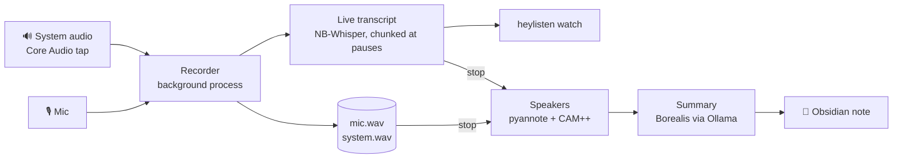

<div align="center">

# 🧚 heyListen

**Hey, listen!** Norwegian meeting notes that never leave your Mac.

Record a Teams, Slack, Meet or in-person meeting and watch the transcript appear as people talk.
When you stop, you get a Markdown note in your Obsidian vault with a summary, decisions, tasks and who said what.


</div>

---

```text
$ heylisten start "Kundemøte"
Recording 'Kundemøte' (2026-10-01-093000). Stop with: heylisten stop
Live transcript below. Ctrl+C closes this view; recording continues.

[00:00:02] Andre: Hei og velkommen, skal vi starte med budsjettet?
[00:00:07] Meg: Ja, jeg tror markedsbudsjettet må økes neste år.
[00:00:11] Andre: Hvor mye mer trenger dere, omtrent?
```

```text
$ heylisten stop
Telling speakers apart on the system track…
Summarizing…
Note: ~/Obsidian/Vault/Møter/2026-10-01 Kundemøte.md
```

```markdown
## Sammendrag
Møtet handlet om å øke markedsføringsbudsjettet for neste år …

## Oppgaver
- [ ] Forberede tall for ledermøtet på fredag (ansvarlig: Taler 2)

## Transkripsjon
**Taler 1** [00:00:02]
Hei og velkommen, skal vi starte med budsjettet?
```

## ✨ Features

- 🔒 **Nothing leaves the machine.** The only network traffic is to your local Ollama, and the binary contains no other networking code. A non-local Ollama URL triggers a red warning on every run.
- 🎙️ **Mic and system audio** as two separate tracks. System audio comes from a Core Audio process tap, so there's no BlackHole or virtual driver.
- ⚡ **Live transcript** with [NB-Whisper](https://huggingface.co/NbAiLab/nb-whisper-large) (the National Library of Norway's Whisper, on Metal). By the time you stop, the transcript is already done.
- 🗣️ **Tells speakers apart**, both remote people and several people around one mic in a meeting room. Uses pyannote and CAM++ via sherpa-onnx.
- 🔁 **Echo removal**, so a meeting without headphones doesn't show every line twice in the note.
- 📝 **Norwegian summary** from [Borealis](https://huggingface.co/NbAiLab/borealis-12b-gguf) through Ollama, written as an Obsidian note with frontmatter and `- [ ]` tasks. The prompt is a file you can edit.
- 💾 **Crash-safe.** Audio streams to disk and the WAV headers are updated every second. The recorder runs on its own, so closing the terminal doesn't stop it.
- 📂 **Import audio files** (m4a, mp3, wav, flac, ogg) such as voice memos or recordings from other tools.

## 🚀 Getting started

```bash
# 1. Models (heyListen never downloads anything itself)
mkdir -p ~/models
curl -L -o ~/models/nb-whisper-large-q5_0.bin \
  https://huggingface.co/NbAiLab/nb-whisper-large/resolve/main/ggml-model-q5_0.bin
ollama pull hf.co/NbAiLab/borealis-12b-gguf

# 2. Build (the Nix dev shell provides Rust and cmake)
git clone https://github.com/nikolaia/heylisten && cd heylisten
nix develop -c cargo build --release

# 3. Check everything
./target/release/heylisten doctor
```

```text
✓ Whisper model /Users/you/models/nb-whisper-large-q5_0.bin
✓ Vault folder /Users/you/Obsidian/Vault/Møter
✓ Ollama running at http://localhost:11434
✓ Ollama model hf.co/NbAiLab/borealis-12b-gguf
```

On your first recording, macOS asks for microphone and system-audio permission for **heyListen**. Allow both. See [macOS permissions](#-macos-permissions) for why it's heyListen asking and not your terminal.

## 🧭 Usage

| Command | What it does |
|---|---|
| `heylisten start [title]` | Starts recording in the background and shows the live transcript. Ctrl+C closes the view; recording continues. |
| `heylisten watch` | Re-attaches the live view. |
| `heylisten status` | Recording or idle, with the title and elapsed time. |
| `heylisten stop` | Stops, tells speakers apart, summarizes and writes the note. |
| `heylisten process <id\|file>` | Redoes a meeting from its saved audio, or imports an audio file. |
| `heylisten doctor` | Pass/fail checks with copy-paste fixes. |

`start` and `stop` also work well from a hotkey app like Raycast.

### Configuration

`~/.config/heylisten/config.toml` is created on first run. An editable Norwegian `summary-prompt.md` is created next to it.

```toml
vault = "~/Obsidian/Vault/Møter"                    # where notes go
whisper_model = "~/models/nb-whisper-large-q5_0.bin"
ollama_model = "hf.co/NbAiLab/borealis-12b-gguf"
ollama_url = "http://localhost:11434"               # keep it local
keep_audio = false                                  # delete WAVs once the note is written
```

## 🔍 How it works



- **Two tracks.** The mic is you (`Meg`) and system audio is the others (`Andre`), so the live view can tell them apart from the start.
- **Live.** Each track is cut into chunks at pauses and transcribed as you talk. After `stop`, only speaker labelling and the summary are left.
- **Speakers.** After `stop`, voices on both tracks are told apart and numbered `Taler 1`, `Taler 2`… in order of first appearance. If the mic hears only one voice, it stays `Meg`. In a meeting room where several people share one mic, heyListen can't know which voice is you, so all of them become `Taler`. Rename them in Obsidian.
- **Language.** Always Norwegian. NB-Whisper translates English speech into Norwegian rather than transcribing it.
- **If Ollama is down,** the note is written without a summary, the audio is kept, and `heylisten process <id>` retries.

Meetings are stored in `~/Library/Application Support/heylisten/meetings/<id>/` on macOS (`~/.local/share/heylisten/meetings` on Linux). The vocabulary is in [CONTEXT.md](CONTEXT.md) and the design decisions in [docs/adr](docs/adr).

## 🍎 macOS permissions

A command-line tool started from a terminal is **silently** refused system audio: no prompt, just an empty track. So the recorder runs from a small `heyListen.app` that heyListen keeps in its data folder. The permissions then belong to heyListen, not to Ghostty, iTerm or Raycast.

- **Approve once.** The app only contains a stable launcher that starts the real binary as its child process, so rebuilding heyListen doesn't trigger new prompts.
- **First recording.** The recording running when you first click Allow may have an empty system track. Later ones are fine.
- **To check:** System Settings → Privacy & Security → *Microphone*, and *Screen & System Audio Recording* → *System Audio Recording Only*. Both should list heyListen.

## 🗺️ Status

| Milestone | |
|---|---|
| Transcribe audio files, `doctor` | ✅ |
| Norwegian summary through Ollama | ✅ |
| macOS recorder (mic + system audio) | ✅ |
| Live transcript, `watch`, echo removal | ✅ |
| Speakers, including several people on one mic | ✅ |
| Linux (PipeWire recording) | 🚧 not implemented or tested on Linux yet |
| Mac menu bar app | 💭 later; the recorder is already a separate process for it to attach to |

**Known limitations**
- The live view labels everyone on the mic `Meg` and everyone on the system track `Andre`. `Taler N` appears after `stop`.
- Builds from the Nix shell link `libiconv` from the Nix store, so the binary isn't portable to machines without Nix yet.

## 🐛 Debugging

```bash
HEYLISTEN_DEBUG=1 heylisten start
```

This makes the recorder log how much audio each track receives, and the speaker turns, to `recorder.log` in the meeting folder.

## 🙏 Credits

- [NB-Whisper](https://huggingface.co/NbAiLab/nb-whisper-large) and [Borealis](https://huggingface.co/NbAiLab/borealis-12b-gguf) from the National Library of Norway.
- [whisper.cpp](https://github.com/ggml-org/whisper.cpp) via [whisper-rs](https://crates.io/crates/whisper-rs).
- [sherpa-onnx](https://github.com/k2-fsa/sherpa-onnx) via [sherpa-rs](https://github.com/thewh1teagle/sherpa-rs), with [pyannote segmentation 3.0](https://huggingface.co/pyannote/segmentation-3.0) (MIT) and [3D-Speaker CAM++](https://github.com/modelscope/3D-Speaker) (Apache-2.0). These are embedded at build time.
- Ideas from [vaqlo](https://github.com/ivshestakov/vaqlo.app).

## License

[MIT](LICENSE)
